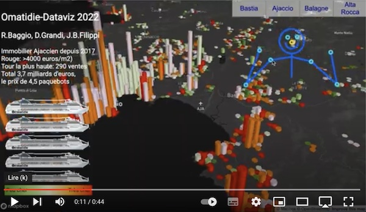

# Ommatidia - Tensor-flow face augmented reality - Dataviz Challenge 2021 - The Observer Observed in a Mobile Real Estate from Different Perspectives

[![Demo on site]](https://filippi.github.io/ommatidie/)

- Real estate values in Corsican zones since 2017
- DVF database from OpenData.corsica

## The Idea
The platform presents real estate values from the DVF (Demand for Property Values) database. The idea here is to offer a different, mobile perspective on real estate, gaining altitude to observe the distribution of wealth and compare regions. 
The proposed interactivity is intended to be intuitive, fun, and aims to evoke astonishment, so it is a bit "artistic," a bit "technical," and a bit "geomatic/cartographic."

A character appears, it's you, in front of the mirror of your screen. After realizing that this mime is mimicking you, you can take control of your dataviz, more interactive than ever.

This avatar will then allow you to select zones with your hands, and change your point of view by looking at your screen closer, to the left, lower... by changing your perspective.

The total transactions are assessed in terms of the number of brand-new cruise ships that could have been bought.

This mimicking avatar is none other than you, the human observer, now projected amidst the data. Now imagine that it is he who is watching you, just as these real estate values command and affect you.

Click on the image for the video:

## Usage
Clone the repository and open index.html with Google Chrome. Best used with a computer equipped with a webcam located just above the screen. Makes a great impression when displayed on a large screen/computer (with webcam) for continuous broadcasting.

## Technologies
- Mapbox.gl -> 3D map base
- Deck.gl -> Overlay for Mapbox with additional sources
- Tensorflow.js -> To activate networks
- Bodypix -> Pre-trained network for webcam-based joint detection

Bodypix is used to locate joint positions. Assuming a standard distance between the eyes, it finds the distance to the screen, with the head position adjusting the perspective and the hand positions changing the zones.

## Where We Borrowed Code Snippets
Thank you to:
- Use of tensorflow.js https://facetouchmonitor.com
- Use of deck.gl, Master SIGAT projects https://sites-formations.univ-rennes2.fr/mastersigat/index.php/realisations/projets-webmapping
 
## The Team
- **Roberta Baggio**, Oletta, Researcher from Padua, just ask her to find, aided by her Saint-Panda Antoine
- **Damien Grandi**, sees far but better up close, integrates better than Runge-Kutta
- **Jean-Baptiste Filippi**, sees close but better from afar, team's out-of-the-box thinker, without limits there's no demise

## Files
- omatidie.py: Downloading from opendata.corsica and formatting the data
- mapprice.js: Map display
- detect.js: Motion detection and UI event handling
